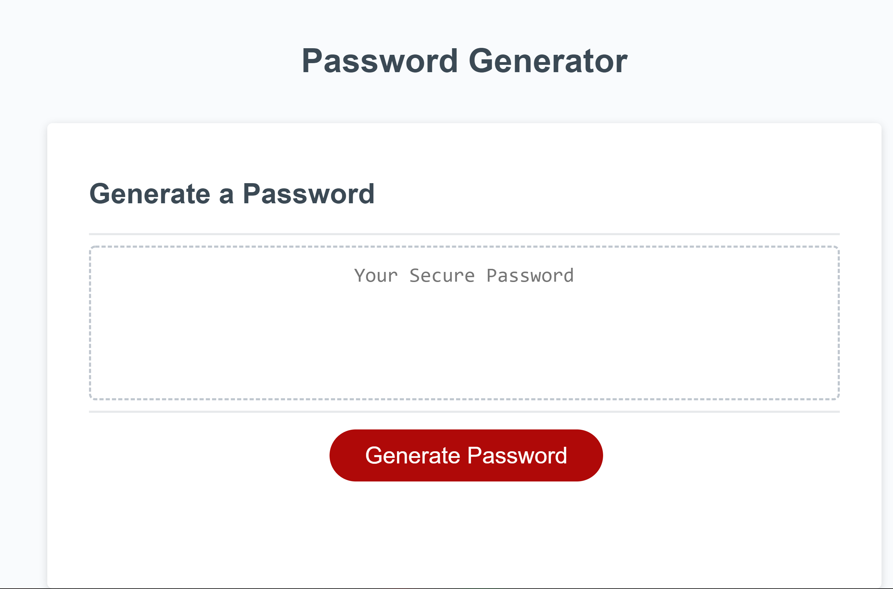

# season3password

## Description

Simple password generator, that should not be used for high security needs, as it uses random math function insterad of crypto.
Published at: https://corhydare.github.io/season3password/

Instructions are as follows:

```
GIVEN I need a new, secure password
WHEN I click the button to generate a password
THEN I am presented with a series of prompts for password criteria
WHEN prompted for password criteria
THEN I select which criteria to include in the password
WHEN prompted for the length of the password
THEN I choose a length of at least 8 characters and no more than 128 characters
WHEN asked for character types to include in the password
THEN I confirm whether or not to include lowercase, uppercase, numeric, and/or special characters
WHEN I answer each prompt
THEN my input should be validated and at least one character type should be selected
WHEN all prompts are answered
THEN a password is generated that matches the selected criteria
WHEN the password is generated
THEN the password is either displayed in an alert or written to the page
```

### Example of the randomizing code

```javascript
for (var i = 0; i <= passLength; i++) {
  var shuffle = Math.floor(Math.random() * alpha.length);
  password += alpha.substring(shuffle, shuffle + 1);
}
```

### Validation html push

```javascript
const validation = document.getElementById("validation");
validation.innerHTML = symSign;
document.getElementById("validation").style.color = "orange";
console.log(symSign);
```

## Prompts

There have been two types of prompts used:

### Confirm

```javascript
var passSymb = confirm("Use special characters?");
if (passSymb) {
  var passSymb = "!@#$%^&*_-+=";
  var symSign = "Special characters will be included.";
} else {
  // notification in case it isn't clear what cancel does
  var passSymb = "";
  var symSign = "Special characters will not be used..";
}
```

### Window.prompt

```javascript
var passLength = window.prompt(
  "Password Length:",
  "Numbers only, between 8 and 128"
);
if (isNaN(passLength)) {
  alert("Invalid length. Defaulting to 8...");
  var passLength = 8;
} else if (passLength < 8) {
  alert("Too short. Defaulting to 8...");
  var passLength = 8;
} else if (passLength > 128) {
  alert("Too long. Defaulting to 128...");
  var passLength = 128;
}
if (!passLength) {
  return;
}
```
## App



## Conclusion

There's so much to javascript than meets the eye. After having changed the entire script countless times, from a single function to multiple functions, from short and simple to more complex and convoluted code.

By the end it became fun and interesting to learn more and more about javascript and in how many different ways one write code to preform one single function. Everyone has a differing opinion on how to solve the problem.
